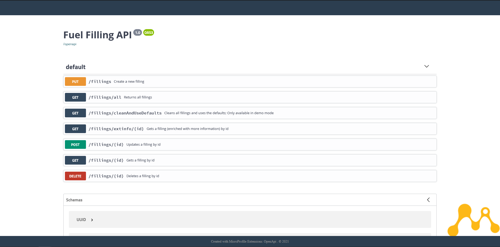

# fuel-filling-service  
A helidon (microprofile) RESTful webservice with microstream.

The project represents a basic CRUD webservice where you can manage fuel fillings (of a car). 
It is also shipped with a nice UI (openapi-ui) so that no external REST/HTTP client is required.

This project was created for the [Microstream hackathon](https://hackathon.microstream.one/)

### Used technologies
* [Microstream](https://microstream.one/platforms/microstream-for-java/)
* [Microprofile (config)](https://github.com/eclipse/microprofile-config)
* [Helidon MP](https://helidon.io/#getting-started)
* Logging via [SLF4J](http://www.slf4j.org/) and [Apache Log4j 2](https://logging.apache.org/log4)
* [OpenApi](https://www.openapis.org/)
* [OpenApi-UI](https://swagger.io/tools/swagger-ui/)
* [GitHub Actions](https://github.com/features/actions) for CI/CD
* [Heroku](https://www.heroku.com/) for hosting the demo

## [Demo](https://hackathon-ms-fuel-filling.herokuapp.com) 
The demo is hosted on heroku.

## Download 
There are prebuilt executables, which save you from building the executable locally.

### JAR
* Check if you have Java 11 installed, if not [install it](https://adoptopenjdk.net/?variant=openjdk11&jvmVariant=hotspot)
* Download the [latest zip from the releases](https://github.com/ab-microstream-hackathon/fuel-filling-service/releases/latest)
* Unzip it and run it locally with ``java -jar fuel-filling-service.jar``
* Open http://localhost:8080 
→ you should get redirected to the OpenAPI UI

## Building / Executing it locally
If you don't want to use the prebuilt executables you can also build the project. 
You can either build and execute this project with Java or Docker.

### Java/JAR
Requirements:
* Java 11
* Maven 3

#### Building the JAR 
* Build the project with ``mvn clean package``
* Run the built jar with ``java -jar target/fuel-filling-service.jar``
* Open http://localhost:8080 

### Docker
Requirements:
* Docker

#### "Normal" Dockerfile
* Build the image with ``docker build -t fuel-filling .``
* Execute it with ``docker run --rm -p 8080:8080 --name fuel-filling fuel-filling``
* Stop/Remove it with ``docker stop fuel-filling``

#### Native Image (experimental)
* Build the native image with ``docker build -f Dockerfile.native -t fuel-filling-native .``

#### JLink Image (experimental)
* Build the native image with ``docker build -f Dockerfile.jlink -t fuel-filling-jlink .``

